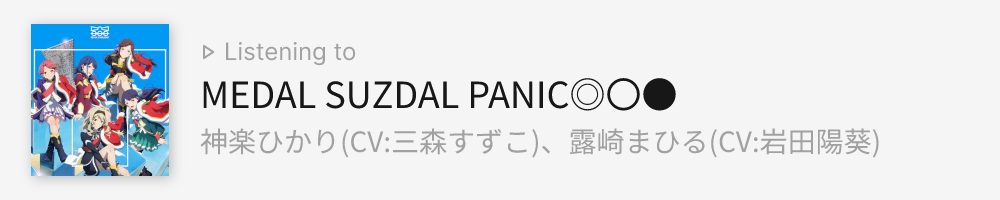
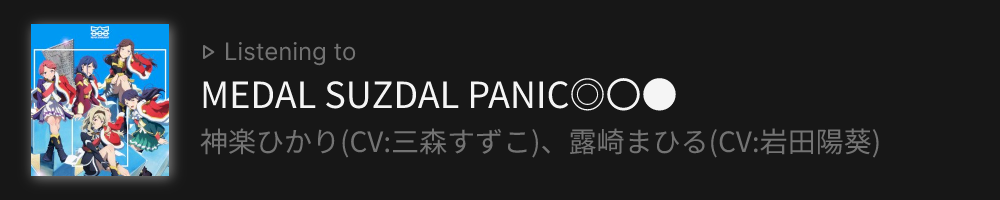

Taken inspiration from [Spotify-equivalent](https://github.com/tthn0/Spotify-Readme) web widget, but with ListenBrainz and MusicBrainz APIs and listen history.

This project was named after Kiriya Aoi~!

### Preview

#### Default (light mode with transparent background)

```
/{username}
```


#### Light mode

```
/{username}?color_mode=light
```



#### Dark mode

```
/{username}?color_mode=dark
```



#### Dark mode with transparent background

```
/{username}?color_mode=dark&transparent=true
```


#### Fill with transparent

Note: fill has to be URI-encoded color hex value

```
/{username}?color_mode=dark&fill=%232b7fff&transparent=true
```


